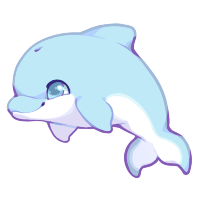
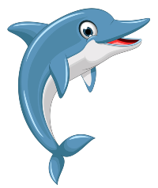
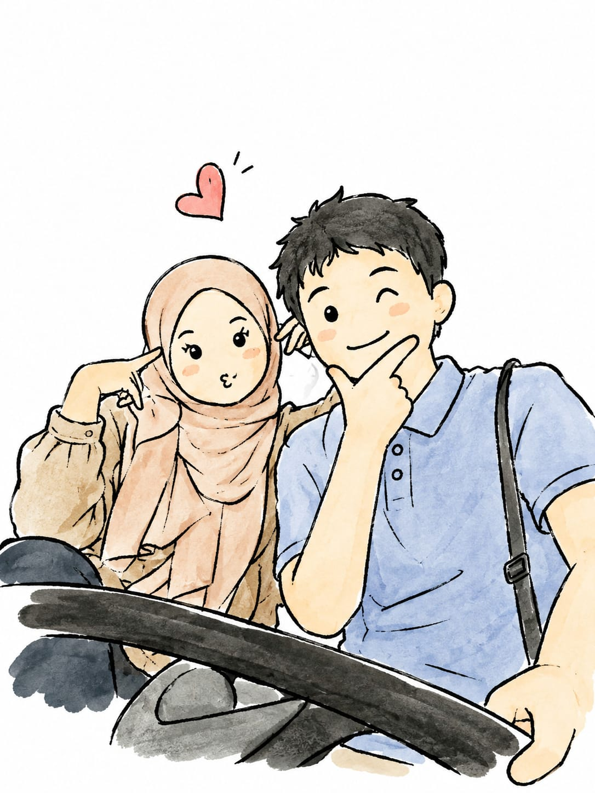

<!DOCTYPE html>
<html lang="id">
<head>
<meta charset="UTF-8">
<meta name="viewport" content="width=device-width, initial-scale=1.0">

<title>Happy Birthday 💙</title>

<link href="https://fonts.googleapis.com/css2?family=Dancing+Script:wght@500;600;700&family=Poppins:wght@300;400;500;600&display=swap" rel="stylesheet">

</head>

<body>

<!-- =========================
     BACKGROUND
========================= -->

    

<!-- =========================
     LUMBA-LUMBA
========================= -->

    

<!-- =========================
     HIU
========================= -->

    

<!-- =========================
     KARTU
========================= -->

    <!-- =====================
         SLIDE 1
    ====================== -->

    <section
        class="slide active"
        id="slide1"
    >

        

            

                🐬
            

            

                A Little Surprise For You
            

            <h1>
                Untukmu 💙
            </h1>

            

                Ada sebuah kejutan kecil
                yang aku siapkan khusus
                untukmu.
            

            

                Masukkan PIN rahasianya
                untuk membuka kejutan ini.
            

            <!-- VIDEO -->

            

            
            

            <!-- PIN -->

            

                <input
                    type="password"
                    maxlength="1"
                    readonly
                >

                <input
                    type="password"
                    maxlength="1"
                    readonly
                >

                <input
                    type="password"
                    maxlength="1"
                    readonly
                >

                <input
                    type="password"
                    maxlength="1"
                    readonly
                >

            

            <!-- KEYBOARD -->

            

                

                    <button onclick="pressNum(1)">
                        1
                    </button>

                    <button onclick="pressNum(2)">
                        2
                    </button>

                    <button onclick="pressNum(3)">
                        3
                    </button>

                

                

                    <button onclick="pressNum(4)">
                        4
                    </button>

                    <button onclick="pressNum(5)">
                        5
                    </button>

                    <button onclick="pressNum(6)">
                        6
                    </button>

                

                

                    <button onclick="pressNum(7)">
                        7
                    </button>

                    <button onclick="pressNum(8)">
                        8
                    </button>

                    <button onclick="pressNum(9)">
                        9
                    </button>

                

                

                    <button onclick="deleteNum()">
                        ⌫
                    </button>

                    <button onclick="pressNum(0)">
                        0
                    </button>

                    <button onclick="checkPin()">
                        💙
                    </button>

                

            

            

            

                ✨ Clue: tahun lahirmu
            

        

    </section>

    <!-- =====================
         SLIDE 2
    ====================== -->

    <section
        class="slide"
        id="slide2"
    >

        

            

                🎂
            

            

                Today Is Your Special Day
            

            <h1>
                Happy Birthday
            </h1>

            <h2>
                Selamat Ulang Tahun 💙
            </h2>

            

       

                <video
                    autoplay
                    muted
                    loop
                    playsinline
                >

                    <source
                        src="mhrjr11.mp4"
                        type="video/mp4"
                    >

                </video>

            

            

            

                Semoga hari ini dipenuhi
                senyum, tawa dan
                kebahagiaan.
            

            

                Semoga setiap detik
                hari ini menjadi
                kenangan yang indah.
            

        

        

            <button
                class="btn"
                onclick="prevSlide()"
            >
                ← Kembali
            </button>

            <button
                class="btn"
                onclick="nextSlide()"
            >
                Lanjut →
            </button>

        

    </section>

    <!-- =====================
         SLIDE 3
    ====================== -->

    <section
        class="slide"
        id="slide3"
    >

        

            

                🐚
            

            

                My Wish For You
            

            <h1>
                Doa & Harapan
            </h1>

 

                <video
                    autoplay
                    muted
                    loop
                    playsinline
                >

                    <source
                        src="mhrjr10.mp4"
                        type="video/mp4"
                    >

                </video>

            

            

                Semoga selalu diberikan
                kesehatan, kebahagiaan,
                dan keberkahan.
            

            

                Semoga semua impian yang
                kamu simpan perlahan
                menjadi kenyataan.
            

            

                Dan semoga senyummu
                selalu ada. ✨
            

        

        

            <button
                class="btn"
                onclick="prevSlide()"
            >
                ← Kembali
            </button>

            <button
                class="btn"
                onclick="nextSlide()"
            >
                Lanjut →
            </button>

        

    </section>

    <!-- =====================
         SLIDE 4
    ====================== -->

    <section
        class="slide"
        id="slide4"
    >

        

            

                💙
            

            

                A Message From My Heart
            

            <h1>
                Untuk Kamu
            </h1>

             

                <video
                    autoplay
                    muted
                    loop
                    playsinline
                >

                    <source
                        src="mhrjr9.mp4"
                        type="video/mp4"
                    >

                </video>

            

            

                Di antara luasnya lautan,
                ada satu hal yang ingin
                aku sampaikan.
            

            

                Terima kasih sudah hadir
                dan menjadi bagian
                dari cerita hidupku.
            

            

                Kamu adalah salah satu
                hal indah yang patut
                disyukuri. 💙
            

        

        

            <button
                class="btn"
                onclick="prevSlide()"
            >
                ← Kembali
            </button>

            <button
                class="btn"
                onclick="nextSlide()"
            >
                Lanjut →
            </button>

        

    </section>

    <!-- =====================
         SLIDE 5
    ====================== -->

    <section
        class="slide"
        id="slide5"
    >

        

            

                🐬💙
            

            

                One Last Message
            

            <h1>
                Terima Kasih
            </h1>

            

                <video
                    autoplay
                    muted
                    loop
                    playsinline
                >

                    <source
                        src="mhrjr8.mp4"
                        type="video/mp4"
                    >

                </video>

            

            

                Terima kasih sudah
                membuka kejutan kecil ini.
            

            

                Semoga perjalanan hidupmu
                selalu indah seperti
                lautan yang luas.
            

            

                Tetap tersenyum,
                tetap kuat,
                dan jangan pernah berhenti
                mengejar impianmu.
            

            <h2>
                Happy Birthday 💙
            </h2>

            

                Semoga bahagia selalu.
                🐬🌊🦈
            

        

        

            <button
                class="btn"
                onclick="prevSlide()"
            >
                ← Kembali
            </button>

        

    </section>

<!-- =========================
     MUSIC
========================= -->

<button
    id="musicToggle"
    onclick="toggleMusic()"
>
    🔇 Musik OFF
</button>

</body>
</html>
.video-box {
    position: relative;

    width: 70%;
    max-width: 280px;

    height: 150px;

    margin: 12px auto;

    overflow: hidden;

    border-radius: 18px;

    background: #023b5c;

    border: 2px solid rgba(140, 235, 255, 0.6);

    box-shadow:
        0 8px 20px rgba(0, 0, 0, 0.3),
        0 0 15px rgba(80, 220, 255, 0.2);

    flex-shrink: 0;
}

.video-box video {
    width: 100%;
    height: 100%;

    object-fit: cover;

    display: block;
}

/* HP */

@media (max-width: 500px) {

    .video-box {
        width: 60%;
max-width: 230px;
height: 125px;
        margin: 10px auto;
        border-radius: 16px;
    }

}
